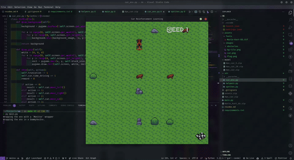
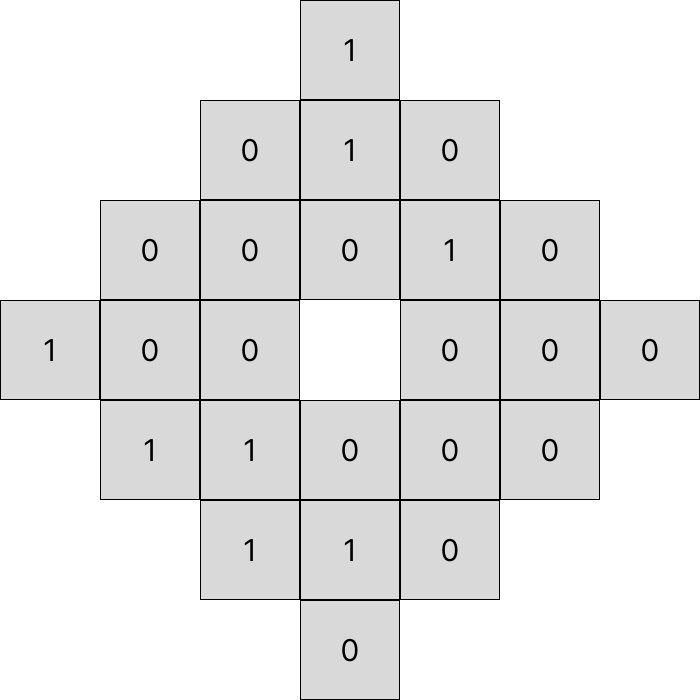
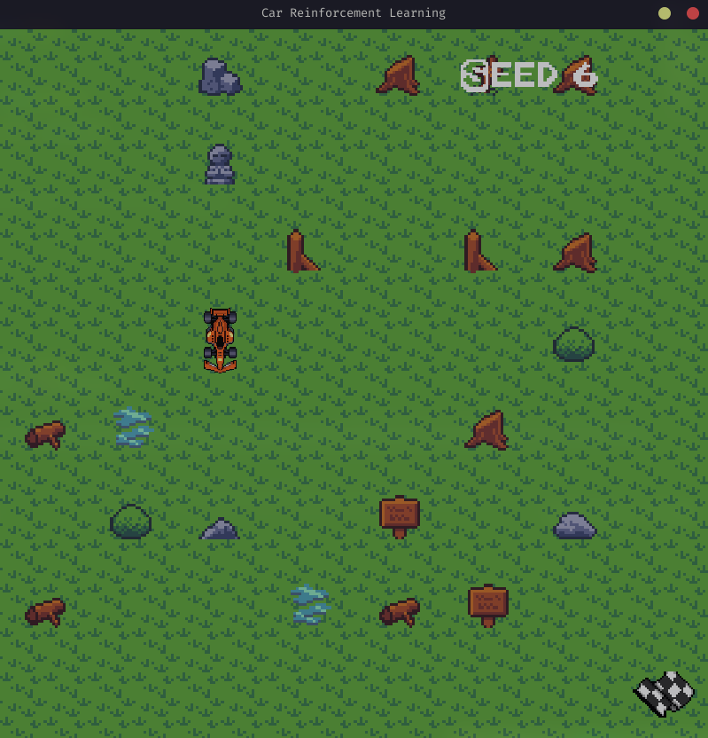

# Project: Reinforcement Learning Grid Navigator


## Introduction

This is one of my first completed projects with reinforcement learning and it took quite some months and a lot of iterations to finally complete it. Nonetheless, I've learned a lot and looks forward to making more cool stuff. It was quite a ride tbh, albeit an interesting one. Here's some of the experience and points I've learned from this project for others reading it and more importantly for the future me.ar

## Project Overview



# Environment

The environment includes

- Obstacles: Which are randomly scattered throughout the world, which the agent has to avoid
- Target: A fixed position which the agent has to navigate it.
- Agent: The model's representative in the environment

# Action space

Action space is just

```py
    action_space = Discrete(4)
```

ie: it can be 0 to move left, 1 to move right, 2 to move up and 3 to move down

# Observation space

Observation space is designed to be relative to the agent as this seemed have the best impact on performance instead of just giving it the entire world as grid each time.

The agent can see around within a one- or two-move radius from its current position.

It's also provided with the time to truncation as the game also ends with a negative reward if it reaches 0, similar to hitting obstacles or walls.

```py
    observation_space = MultiDiscrete([3] * 24 + [30 + 1])
```

The environment around the agent is represented with the first 24 cells with 0 if it's free, 1 for target and 2 for obstacle 

An example observation space

```py
[ 1  0  1  0  0  0  0  1  0  1  0  0  0  0  0  1  1  0  0  0  1  1  0  0 25]
```

it's image representation 



It's actual representation from the game



# Algorithm

The project currently uses DQN as it is faster and due to the random nature of the environment could benefit from it's off-policy nature through lack of biases when it comes to exploration, also DQN seemed to be faster than other good alternates like PPO; which is an on-policy algorithm. Cnn seemed like a good policy for this project due to the observation space being a grid but it was too slow, perhaps I will try it some other time. Hence, the project used MlpPolicy.

## Key Takeaways

- **Environment Speed:** Faster environments lead to quicker training and require fewer timesteps. Initially, use a fast-paced environment to ensure everything works smoothly, then slow it down if you need to demonstrate it to others.
- **Action Space Management:** Start with a reduced action space. As the model progresses, gradually introduce new changes, including environmental randomness.
- **Don't overtrain the model:** Train the model by gradually increasing the difficulty, but don't overtrain any specific difficulty as this can horribly impact the performance. In this case training by sets of 1,00,000 seemed to work fine.

## Steps & Progress

1. **Initial Setup:**

   - Trained for 2,000,000 timesteps.
   - Outcome: Barely any progress with a high standard deviation.

2. **Action Space Reduction:**

   - Limited actions to left, none, right. Fixed positions for the car and fuel. Reduced truncation to 80.
   - Outcome: Significant progress.

3. **Speed Adjustments:**

   - Slower car: More training time needed but results similar.
   - Fast car with random fuel placement: Good progress.

4. **Tweaks to Fuel System:**

   - Fuel collection no longer ends the game, increased truncation by 3x, allowing time for three fuel collections. Fuel was reduced to 80 (just enough to get from one fuel to another).
   - Outcome: Progress was good but highly variable.

5. **Observation Space Overhaul:**

   - Implemented a grid-like environment with a matrix representing the agent’s location, obstacles, and the target.
   - Realized it was suboptimal and switched to observations relative to the agent's position, allowing the agent to see only its immediate surroundings.
   - Issue: Local loops where the agent repeated actions due to limited observation space.

6. **Observation Space Expansion:**

   - Increased observation space to include all positions within two steps of the agent.
   - Outcome: Significantly reduced local loops.

7. **Edge Classification:**

   - Edges of the grid are treated as obstacles. Touching an edge ends the game.

8. **Reward Function Adjustment:**

   - Updated rewards: +5 for reaching the target, -1 for hitting an obstacle or edge, -10 for running out of time without reaching the target.

9. **Further Observation Space Testing:**

   - Increased observation scope to three steps, then to five steps.
   - Outcome: Performance of 3-step and 5-step scopes was similar, reverting to 3 steps.

10. **Final Progress:**

- Agent seems to have made very good progress, completing at least 1 in 20 games successfully, so currently ending the project here.
- Will probably come back to this project at a later date if I learn to increase the win rate. But as of yet can't really make much progress.

## Assets

Grass: https://ninjikin.itch.io/grass

## Video

[](https://www.youtube.com/watch?v=isF4E8Fo4R4)

## Conclusion

The project went through multiple iterations, starting with a broader approach and gradually refining the model by adjusting the observation space and reward system. Key learnings include the importance of manageable action space and observation scope, adjusting the reward structure, usage of different algorithms and policies. The final setup with a 3-step observation space provides a balanced performance.
